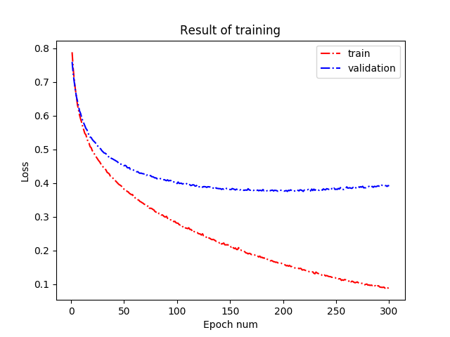

# Classification_dogs and cats
This repository consists of the code for classification of dogs and cats.

## Contents of the repository
I implemented dogs and cats classification network with python.  
I use some network architecture. For example, resnet, vgg and so on.  

## Result of training
I show loss and accuracy graphs. 

### Loss graph

### Accuracy graph

## Contact
If you can know about detail me, you can see my website.

Qitta page: https://qiita.com/chi-na  

Wantedly page: https://www.wantedly.com/users/113653637  

Github page: https://github.com/chihina
